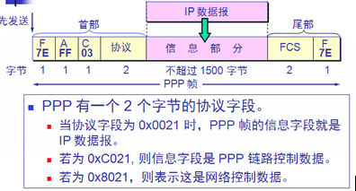

**阅读本文你能收获到**

* 了解网络模型中各层的工作内容及使用协议
* 掌握各层中比较核心的协议及运行原理

**目录索引**

[协议模型](#1模型)     
—— [应用层](#1_1)   
————[DNS域名系统](#1_1_1)   
———— [简单邮件传送协议SMTP，邮件读取协议POP3/IMAP](#1_1_2)   
————  [文件传送协议FTP](#1_1_3)   
—— [传输层](#1_2)  
————  [TCP协议](#1_2_1)   
————  [UDP协议](#1_2_2)   
—— [网络层](#1_3)  
————  [网际协议 IP](#1_3_1)   
————  [网际控制报文协议ICMP](#1_3_2)   
————  [内部网关协议RIP/OSPF](#1_3_3)   
————  [外部网关协议BGP](#1_3_4)   
————  [路由器详解](#1_3_5)   
—— [数据链路层](#1_4)  
—— [物理层](#1_5)  

<h2 id="1">协议模型</h2>
主流网络结构分为 OSI七层协议和五层协议模型

* 七层：物理层，数据链路层，网络层，传输层，（会话层， 表示层，应用层
* 五层：物理层，数据链路层，网络层，传输层，应用层

<h3 id="1_1">应用层</h3>
通过进程之间的交互来完成特定网络应用，所以对应的协议也定义为应用进程间通信和交互的规则 电子邮件SMTP协议，万维网的http协议，交互的数据单位一般是报文

**主要内容**

* 规定应用进程在通信时所需要遵循的协议
* 许多协议基于Client/Server模型，分别对应通信的两个进程，Client为服务请求方，Server为服务提供方
* 域名系统的的工作原理

**涉及协议**

* 简单文件传输协议TFTP
	
	使用UDP传输但是有自己的差错改正策略, 只支持文件传输不支持交互
* 路由信息协议RIP
* 动态主机配置协议DHCP
* 简单网络管理协议SNMP
* 网络文件系统NFS（允许打开远地文件，允许读写）

	上面基于UDP，下面基于TCP
* `简单邮件传送协议SMTP，邮件读取协议POP3/IMAP(重点掌握)`
* 远程终端协议TELNET
* 网络虚拟终端 NVT 格式
* `超文本传送协议HTTP (重点掌握)`
* `文件传送协议FTP（重点掌握）`
    
了解应用层, 首先了解下域名系统DNS

<h4 id="1_1_1"> DNS域名系统</h4>

DNS系统主要用于根据域名查询对应的IP地址, 是域名和IP映射的分布式数据库。

常见的查询手段由两种: 迭代查询 和 递归查询。

**迭代查询 （常用手段)**

* 程序向本地域名服务器查找, 找到就返回程序, 结束
* 本地域名服务器 -> 根域名服务器, 找到就返回程序, 结束查找
* 本地域名服务器 -> 顶级域名服务器, 找到就返回程序, 结束查找
* 本地域名服务器 -> 权限域名服务器, 找到就返回程序, 结束查找

**递归查询**

* 程序向本地域名服务器查找, 找到就返回程序, 结束
* 本地域名服务器 -> 根域名服务器, 原路返回, 结束
* 根域名服务器 -> 顶级域名服务器, 原路返回, 结束
* 顶级域名服务器 -> 权限域名服务器, 原路返回, 结束

<h4 id="1_1_2">简单邮件传送协议SMTP，邮件读取协议POP3/IMAP</h4>

* 发送邮件的协议：SMTP
* 读取邮件的协议：POP3 和 IMAP

MIME 在其邮件首部中说明了邮件的数据类型(如文本、声音、图像、视像等)，使用MIME可在邮件中同时传送多种类型的数据。

**邮件的传输流程**


**发送和接收邮件的步骤**

1. 发件人调用 PC 中的用户代理撰写和编辑要发送的邮件。
2. 发件人的用户代理把邮件用 SMTP 协议发给发送方邮件服务器，
3. SMTP 服务器把邮件临时存放在邮件缓存队列中，等待发送。
4. 发送方邮件服务器的 SMTP 客户与接收方邮件服务器的 SMTP 服务器建立 TCP 连接，然后就把邮件缓存队列中的邮件依次发送出去。
5. 运行在接收方邮件服务器中的SMTP服务器进 程收到邮件后，把邮件放入收件人的用户邮箱中，等待收件人进行读取。
6. 收件人在打算收信时，就运行 PC 机中的用户代理，使用 POP3（或 IMAP）协议读取发送给自己的邮件 

<h4 id="1_1_3">文件传送协议FTP</h4>

FTP服务器进程由：主进程（负责接受新的请求）、从属进程（负责处理单个请求）构成。 传输文件时, FTP客户端和服务端之间建立两个并行的TCP连接。在整个回话期间一直保持打开，FTP客户所发送的传送请求通过该连接发送给服务器端的控制进程。 

**FTP文件传送流程**


<h3 id="1_2">传输层</h3>
> 引用层提供了`通讯数据内容规则`, 那么这部分数据内容是怎么进行传输呢？ 这里的传输指的是进程间的传输规则, 而并不是物理上的传输（物理上的传输见数据链路层和物理层）

传输层有两个核心的功能： **复用** 和 **分用**

* 复用, 发送方不同的应用进程都可以使用同一个运输层协议传送数据
* 分用, 接收方的运输层可以剥去报文的首部后把这些数据正确地交付给目的应用进程

还有一个概念就是 `运输协议数据单元（TPDU）`

* TCP协议传送的数据单位TCP报文段
* UDP协议传送的是UDP报文或用户数据报

这两种协议又何不同呢？ 

<h4 id="1_2_1">TCP协议</h4>
TCP 作为连接双方的基础, 每一条 TCP 链接都对应两个端点, TCP 连接的端点不是主机, 不是主机的IP 地址, 不是应用进程, 也不是运输层的协议端口, TCP 连接的端点叫做套接字(socket)或插口。 

所谓套接字, 就是socket, 格式为 ```IP地址:端口号```, TCP 连接的唯一确定通讯的两端可表示为 

```
TCP 连接 ::= {socket1, socket2} = {(IP1: port1), (IP2: port2)}
```
**TCP报文头部**


TCP报文头部长度为 固定20字节 + 可选长度 + 填充, 各字段的含义如下

* 源端口和目的端口字段 —— 各占 2 字节。端口是运输层与应用层的服务接口。运输层的复用和分用功能都要通过端口才能实现
* 序号字段 —— 占 4 字节。TCP 连接中传送的数据流中的每一个字节都编上一个序号。序号字段的值则指的是本报文段所发送的数据的第一个字节的序号
* 确认号字段 —— 占 4 字节，是期望收到对方的下一个报文段的数据的第一个字节的序号
* 数据偏移（即首部长度) —— 占 4 位，它指出 TCP 报文段的数据起始处距离 TCP 报文段的起始处有多远。“数据偏移”的单位是 32 位字
* 紧急 URG —— 当 URG 1 时，表明紧急指针字段有效。它告诉系统此报文段中有紧急数据，应尽快传送(相当于高优先级的数据)
* 确认 ACK —— 只有当 ACK  1 时确认号字段才有效。当 ACK  0 时，确认号无效
* 复位 RST (ReSeT) —— 当 RST 1 时，表明 TCP 连接中出现严重差错（如由于主机崩溃或其他原因），必须释放连接，然后再重新建立运输连接
* 同步 SYN —— 同步 SYN = 1 表示这是一个连接请求或连接接受报文
* 推送 PSH ——当两个应用程序进行交互式的通信时, 一端的应用进程希望在键入一个命令后立即就能够收到对方的响应。在这种情况下, TCP可以使用推送(push)操作。这时发送端TCP将推送比特PSH置为1,并立即创建一个报文段发送出去。接收TCP收到推送比特置1的报文段, 就尽快地(即"推送向前")交付给接收应用进程而不再等到整个缓冲都填满了再向上交互。
* 终止 FIN (FINis) —— 用来释放一个连接。FIN = 1 表明此报文段的发送端的数据已发送完毕，并要求释放运输连接
* 窗口字段 —— 占 2 字节，用来让对方设置发送窗口的依据，单位为字节
* 检验和 —— 占 2 字节。检验和字段检验的范围包括首部和数据这两部分。在计算检验和时，要在 TCP 报文段的前面加上 12 字节的伪部
* 紧急指针字段 —— 占 16 位，指出在本报文段中紧急数据共有多少个字节（紧急数据放在本报文段数据的最前面）
* 选项字段 —— 长度可变。TCP 最初只规定了一种选项，即最大报文段长度MSS。MSS 告诉对方 TCP：“我的缓存所能接收的报文段的数据字段的最大长度是 MSS 个字节

> 值得注意的是: "MSS (Maximum Segment Size)是 TCP 报文段中的数据字段的最大长度, 数据字段加上 TCP 首部"。
MSS 为TCP数据包每次能够传输的最大数据分段, 为了达到最佳的传输效能, TCP协议在建立连接的时候会写上双方的 MSS 值, 而这值的计算往往是

```
MSS = MTU - IP数据报首部20字节 - TCP数据报头部大小
```
默认的 MSS 为 536字节
那么 MTU 又是什么东东呢？ 但是从公式上看 MTU 就是 IP 数据包的大小呀 ！如果想进一步了解 MTU, 在下面 `网际协议 IP` 有涉及到。 
而这个值的大小是由链路层中帧所能携带的数据字段决定的, 称为 `最大传输单元（Maximun Transfer Unit）`
所以一个 TCP 包的大小受到限制 MSS, 如果应用层数据超过 MSS 则会进行分段处理. 但是 UDP 却不同，UDP 可传输数据报（网络层）, 直接把数据报交给网络层, 如果超过IP数据报的总长度, 才会进行分片。

**TCP的有限状态机**


TCP的状态机诠释了整个TCP连接到终结的流程, 详情页握手信息见另一篇文章。

<h4 id="1_2_2">UDP协议</h4>
发送方 UDP 对应用程序交下来的报文，在添加首部后就向下交付 IP 层。UDP 对应用层交下来的报文，既不合并，也不拆分，而是保留这些报文的边界。也就是说，应用层交给 UDP 多长的报文，UDP 就照样发送，即一次发送一个报文。 

接收方 UDP 对 IP 层交上来的 UDP 用户数据报，在去除首部后就原封不动地交付上层的应用进程，一次交付一个完整的报文。

**UDP的数据报格式**


从上图上看, UDP 把整个数据都交付给网络层处理。UDP传输数据报受限于MTU, 如果下层IP数据报超过该限制则需要IP分片, 而TCP传输报文段受限于MSS, 如果传输报文段超过 MSS 则需要 TCP 分段。
 

<h3 id="1_3">网络层</h3>
> 传输层和应用层分别提供了`通讯数据内容规则`和`数据传输服务`，那么怎么知道传输的目的地在哪里呢 ？
> 在没有细看下面篇章的情况下, 如果让你设计一个网络层, 你会有哪些思路呢 ？

**假想场景**

应用层和传输层其实有个贴合显示的场景代入： "某一个淘宝店家 (应用程序) 打包自己的货物 (类应用层), 然后让快递员揽件突突突开车发送给买家（类传输层）。"  那么快递员要怎么知道这个包裹要送到哪里呢？ 显然是根据卖家提供的地址。 在互联网上的众多主机便是对应现实中的 house, 所以需要为互联网的主机提供地址服务

**主要内容**

 * 为通讯双方设计地址服务, 涉及的协议包括
     * `网际协议IP (重点掌握)`
     * 地址解析协议ARP（网络层下部）
        * 每一个主机都设有ARP高速缓存, 里面有本局域网上的各主机和路由器的IP地址和硬件地址的映射表。如果表中还没存在目标IP项, 则广播通知所有局域网上的主机，响应者以单播的形式发送硬件地址到广播者。
          主要作用是通过 IP 获取 MAC 地址。它的作用和 `逆地址解析协议RARP` 刚好是相反的。
     * 逆地址解析协议RARP
        * 把硬件地址解析成ip地址
     * `网际控制报文协议ICMP（重点掌握, 网络层上部）`
     * 网际组管理协议IGMP（网络层上部）
        * 连接在本地局域网上的多播路由器知道本局域网上是否在主机（其实是主机上的某个进程）参加或退出了某个多播组。
     * IP隧道技术：VPN，用于多个专用网之间的通讯
        * 常用于 vpn, 用于多个专用网之间的通讯
     * 网络地址转换NAT
        * 比如说一个专用网192.168.0.0内所有主机通过NAT路由（NAT软件，至少有一个全球IP），所有IP数据报都改成全球IP；如果接收到的IP数据包会根据本地的NAT地址转换表来发送给专用网内的主机。
     * `内部网关协议RIP/OSPF（重点掌握）`
     * `外部网关协议BGP（重点掌握）`

     > 重点掌握的协议在下面子篇章中进行详解, 同时还有路由器原理

 通过中间设备路由器来传输 IP 数据报

<h4 id="1_3_1">网际协议 IP</h4>
**定义地址** 

使用 32位地址, 以 `点分十进制` 表示。常见的网络格式为 IP地址 = 网络地址（net-id） + 主机地址（host-id）

目前主要的 IP地址 类型有三类： A类, B类, C类

| 类型        | 限制          |  net-id有效位数  | host-id有效位数  |最大网络数          |最大主机数     |IP地址范围                      |私有IP地址范围  |
| --------   | :-----:      | :----:            | :----:        |:----:             |:----:     |:----:                         | :----:     |
| A类        | 第一位必须是0   |   8-1             | 24            | 126(2^7-2)        | 16777214  |0.0.0.0-127.255.255.255        | 10.0.0.0-10.255.255.255      |
| B类        | 前两位必须是10  |   16-2            | 16            | 16384(2^14-2)     | 65534     | 128.0.0.0-191.255.255.255    | 172.16.0.0-172.31.255.255    |
| C类        | 前三位必须是110  |   24-3           | 8             | 2097152(2^21-2)   | 254       | 192.0.0.0-223.255.255.255    | 192.168.0.0-192.168.255.255    |

> 上述表格有个 "私有IP地址范围", 这部分地址无法在英特网中使用, 但是为什么需要从 ABC类抽离这部分 IP 地址呢？
> 了解为需要这两个部分 IP 的是用之前先看看几个通俗的概念。
> 所谓网络数, 即某类型网络的数量, 主机数指的是单个网络中IP的数量
> 公网IP, 即上述表格 "IP地址范围中" 的IP, 公网 IP 的主机可以相互随意访问。
> 内网IP, 即上述表格 "私有IP地址范围" 内的 IP, 也就是子网中使用的 IP

由于 ABC 类的 IP 地址有限, 无法为每一个主机分配 IP, 所以希望能在原有 IP 的基础上扩大使用范围, 于是子网产生了, 也就是经常所说的内网/局域网。
通常内网内的所有主机对外是同个公网 IP, 对内每个主机都拥有独立的内网 IP, 那么子网如何产生的 ？用的是 `子网掩码`
    
**子网掩码** 

用于识别 IP 地址中哪部分是网络地址, 哪部分是主机地址, 作为划分子网的重要参数
    
| 类型        | 默认子网掩码      |  二进制表示方法| 子网能容纳的主机数|
| --------   | :-----:      |:-----:  |:-----:  | 
| A类        | 255.0.0.0     | 11111111 00000000 00000000 00000000|最多1677万|
| B类        | 255.255.0.0   | 11111111 11111111 00000000 00000000|最多6万|
| C类        | 255.255.255.0  | 11111111 11111111 11111111 00000000|最多253|
    
如何选择子网掩码是根据需要容纳的子网主机数量来决定的。比如说想要构建一个 1000 台主机的子网, 则需要的主机地址位至少10位。 此时子网掩码为
    
11111111 11111111 11111100 00000000
    
可以看出, 该掩码是属于 B 类子网掩码, 所以我们再 B 类的私有 IP 地址中找一个符合条件范围的 176.16.*.*
    
10110000 00010000 ??????** ******** （其中 ?????? 为任意 0 或者 1。 这里取 0, 则得到下面 IP）
    
10110000 00010000 000000** ********
    
那么就得到这 1000 台主机可使用的 IP 有 176.16.1.x, 176.16.2.x, 176.16.3.x
    
该子网内的任何 IP 与子网掩码做 `与运算` 都能得到
    
10110000 00010000 00000000 00000000 （176.16.0.0）
    
    所以它们都在同一个网段 。
    
        > 评判两个 IP 地址是否处于同个网段手段是与各自对应的子网掩码做与运算得到的结果是否一致。

* 定义数据报结构

  

   IP数据包的结构说明

   * 版本, 4位,  指定 IP 协议版本, 比如 IPv4 等
   * 首部长度, 4位, 即图中蓝色区域大小, 一般 0101表示 20 字节， 即没有可选字段。 如果为 1111 表示 60 字节, 即可选字段+填充为 40 字节。 值得注意的是, 首部长度一定需要是 4 字节倍数, 不满足条件时使用填充字段补满。
   * 区域服务, 8位, 只有使用区分服务时才使用。
   * 总长度, 16位, 指的是IP数据包总共有多少字节, 16 位总共最大位 2^16-1 = 65535 字节 。 值得注意的是下层数据链路层在帧格式中定义了数据的最大长度, 即最大传送单元 MTU（Maximum Transfer Unit）, 所以数据包不能超过下层规定的 MTU 值。
   * 标识, 16位, IP软件在存储器中维持一个计数器, 每产生一个数据报, 计数器加 1, 并赋值于此。 当数据报超过 MTU 值的时候需要分片传输, 这个字段的值会被复制到所有数据报的标示字段中, 只有相同的标示字段才能重装成原来的数据报。
   * 标志, 3位, 最低位 MF 为 1 时标示还有分片数据, 为 0 时标示已是若干数据报片中的最后一个。
   * 片偏移, 13位, 记录某片在原分组的相对位置。 片偏移以 8 字节为偏移单位, 除了最后一个分片外, 其他分片长度一定是 8 字节整数倍
   * 生存时间, 8位, 即 TTL, 以秒位单位。 表明数据报在网络中的寿命。 为了防止无法交付的数据报在 Internet 兜圈浪费资源, 每经过一个路由器， TTL 就会消耗一个时间, 当 TTL 为0时就丢弃这个数据报， 后来 TTL 功能改为 "跳数限制"。 当路由器在转发数据报之前就把 TTL 减一, 若为0则对其该数据报。 如果数据报在网络上流转, 最大值为 255, 若初始值为 1 则表示在本局域网中传送。
   * 协议, 8位, 表示数据报携带的数据使用哪一种协议, 以便目的主机收到后知道如何交给上层哪个协议处理。
   * 首部校验和, 16位, 只会校验数据报的头部。 每经过一个路由器就会重新计算首部校验和。
   * 源地址, 32位
   * 目的地址, 32位
   * 可变部分, 大小从1-40字节不等, 常用于排错, 测量或者安全检测等, 扩展IP数据报的功能，但是很增大每个路由器处理数据报的开销。 IPv6 把数据报长度设计位固定值。


<h4 id="1_3_2">网际控制报文协议ICMP</h4>
常见于 ping, traceroute 等功能, 前者是基于ICMP询问报文, 后者是基于ICMP差错控制报文

差错报告报文：终点不可达、源站抑制、时间超过、参数问题、改变路由

询问报文：回送请求或回答、时间戳请求或回答
其报文结构


<h4 id="1_3_3">内部网关协议RIP/OSPF</h4> 
**RIP协议**, 分布式基于距离向量的路由选择协议

* 计算规则: 要求网络中每一个路由器都要维护从它自己到其他每一个目录网络的距离记录
    * 从一路由器到直接连接的网络的距离定义为 1
    * 从一个路由器到非直接连接的网络的距离定义为所经过的路由器数加 1
    * “距离”也称为“跳数”(hop count)，因为每经过一个路由器, 跳数就加 1

* 报文格式

	

**OSPF协议**, 使用 Dijkstra 提出的最短路径算法SPF, 它并不表示其他的路由选择协议不是“最短路径优先”，是分布式的链路状态协议。

* 报文格式

	

<h4 id="1_3_4">外部网关协议BGP</h4> 
每一个自治系统的管理员要选择至少一个路由器作为该自治系统的“ BGP 发言人”。 一般说来，两个 BGP 发言人都是通过一个共享网络连接在一起的，而 BGP 发言人往往就是 BGP 边界路由器，但也可以不是 BGP 边界路由器。

**BGP-4使用以下4种报文**

1. 打开(OPEN)报文, 用来与相邻的另一个BGP发言人建立关系。
2. 更新(UPDATE)报文, 用来发送某一路由的信息，以及列出要撤消的多条路由。
3. 保活(KEEPALIVE)报文, 用来确认打开报文和周期性地证实邻站关系。
4. 通知(NOTIFICATION)报文, 用来发送检测到的差错。
    
**报文格式**


<h4 id="1_3_5">路由器详解</h4> 
先看一张计算机网络路由结构图

 

**分组处理**

从上图结构中可以看到, 分组(数据片)从物理层 -> 链路层 -> 网络层, 将分组送到网络层队列之前需要去除帧首部和尾部。在队列等待处理会存在一定的时延。 等交换结构传送过来的分组需要先进行缓存, 在数据链路层中分别加上帧头部和尾部, 然后交给物理层发送到外部线路。

**路由表和转发表**

* 路由表

	由路由选择算法计算得出, 通过查询路由表来得到最佳路经。 内容包括： 目的网络地址及对应的目的端口, 掩码, 下一跳路由的名字。 路由表可以人为编程设置路经, 称为静态路由选择; 也可以经过路由器自动调整, 称为动态路由选择。

* 转发表

    转发表是通过路由表得来的。 当数据报达到路由器, 根据转发表的指示前往特定的端口。

**路由选择协议**

* 距离向量路由选择协议

    距离向量路由选择协议的分组传送路由是根据到接收站的hop数或费用决定的，这些信息由各相邻的路由器提供。技术上通常都遵循Bellman－Ford（单源最短路经算法）算法。

    价值度度量是价值度量是路由器向前传送分组到网中下一个路由器时选择路径所用的量值, 可使用RIP协议或者内部网关路由选择协议IGRP。 路由器可能存在多个端口, 每个端口管理员可以设置价值, 加上把分组传送到目的地所用的代价计算除量值。

    * 端口1价值10 + 相邻路由器价值17=27
    * 端口2价值20 + 相邻路由器价值5=25
    * 端口3价值30 + 相邻路由器价值7=37

    上述三个端口中传送分组代价最小的是端口2, 所以使用端口2进行分发。

* 链路状态路由选择协议

    链路状态路由选择比距离向量路由选择需要更强的处理能力，但它可以对路由选择过程提供更多的控制和对变化响应更快。路由选择可以基于避开拥塞区、线路的速度、线路的费用或各种优先级别。

    基于 Dikkstra 的最短路径算法计算路由根据如下

    * 分组到达目的站经过的路由器数量，这叫做路由中继（hop），并且hop数越少越好
    * 局域网间传输线路的速度。有些路由使用低速异步连接，而另一些路由使用高速数字链路
    * 信息拥塞将造成延迟。如果一台工作站传送一个大文件，路由器可以通过不同的路径发送分组以避免交通阻塞


<h3 id="1_4">数据链路层</h3> 
如果前面我们认为一个基本的传送已经好了，当时事实上上面的一系列都是逻辑层面的，我们需要在现实中建立物理连接。把上面的那些内容封装成链路层发送单位（帧），然后加上特定的一些控制信息；MAC地址。

数据链路层研究的是在同一个局域网中，分组怎样从一个主机传送到另一个主机（不经过路由器）；其协议就是接收方每收到一个帧，就进行CRC检验，若检验正确就收下这个帧，反之则丢弃

**数据帧结构**


帧的传输传输一定是可靠传输,  并且链路是一条无源的点到点的物理线路段, 中间没有任何其他的交换节点

数据链路层除了有物理线路外, 还必须要通讯协议来控制传输的传输, 如 点对点协议ppp

**点对点协议ppp**

是用户计算机和ISP进行通信时所使用的数据链路协议

* 协议涉及的范围

	

* ppp协议帧格式
    
	
    
* 工作流程
	* 当用户拨号接入 ISP 时，路由器的调制解调器对拨号做出确认，并建立一条物理连接。
	* PC 机向路由器发送一系列的 LCP 分组（封装成多个 PPP 帧）
	* 分组及其响应选择一些 PPP 参数，和进行网络层配置，NCP 给新接入的 PC机分配一个临时的 IP 地址，使 PC 机成为因特网上的一个主机
	* 通信完毕时，NCP 释放网络层连接，收回原来分配出去的 IP 地址。接着，LCP 释放数据链路层连接。最后释放的是物理层的连接


<h3 id="1_5">物理层</h3>    
这个是把我们封装的帧转成比特流，通过物理路径传过去我们的通信方

**物理层规程（物理层协议）**

* 数据(data)——运送消息的实体。
* 信号(signal)——数据的电气的或电磁的表现。
* “模拟的”(analogous)——代表消息的参数的取值是连续的。
* “数字的”(digital)——代表消息的参数的取值是离散的。
* 码元(code)——在使用时间域（或简称为时域）的波形表示数字信号时，代表不同离散数值的基本波形。
	
在任何信道中，码元传输的速率是有上限的，否则就会出现码间串扰的问题，使接收端对码元的判决（即识别）成为不可能。（奈氏准则）如果信道的频带越宽，也就是能够通过的信号高频分量越多，那么就可以用更高的速率传送码元而不出现码间串扰。这涉及到 “信号调制”, "速率问题"及“信道复用问题”。
